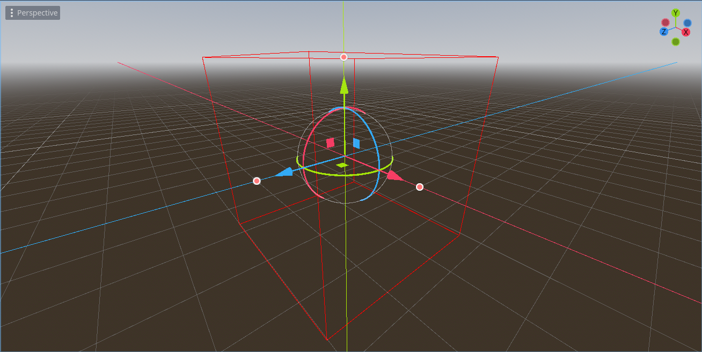
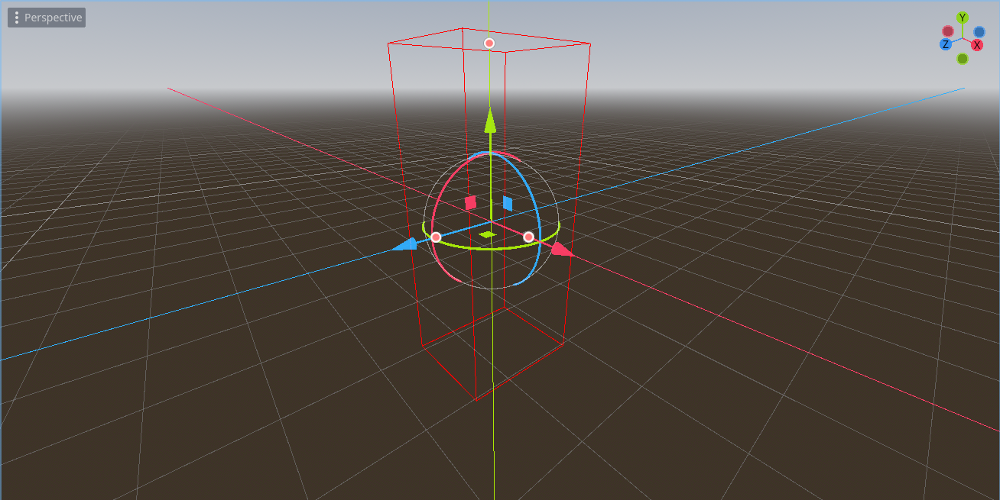

# Godot 4.1 Custom Cube Gizmo Plugin (Demo Project)

 

**Note: This project serves as an example for creating and using Gizmo Plugins in Godot 4.1.**

This is a simple Godot 4.1 scene containing a demo object that utilizes the `ExampleCubeGizmoPlugin`. The plugin allows you to interact with and manipulate a cube-shaped object in the 3D editor.

## Getting Started

1. Download or clone this project to your local machine.

2. Open the project in Godot Engine 4.1 or a later version.

3. Open the scene named `example.tscn`.

4. You should see a cube-shaped object in the 3D editor.

## How to Use the Gizmo

The `ExampleCubeGizmoPlugin` provides a gizmo for interacting with the cube object in the editor. Here's how to use it:

1. Select the cube-shaped object in the 3D editor.

2. You should see handles appear around the cube. There are three handles: one for each axis (X, Y, and Z).

3. Click and drag on the handles to resize the cube along the corresponding axis.

   - **X Handle**: Resize along the X-axis.
   - **Y Handle**: Resize along the Y-axis.
   - **Z Handle**: Resize along the Z-axis.

4. As you drag the handles, the cube will resize accordingly.

5. You can use this gizmo to adjust the cube's dimensions to your liking.

## License

This project is licensed under the [MIT License](LICENSE.md).

---

Enjoy using the ExampleCube Gizmo Plugin in your Godot 4.1 projects! This project serves as an example of how to create and utilize Gizmo Plugins in Godot. If you have any questions or encounter any issues, please feel free to [open an issue](https://github.com/arnemileswinter/godot-cube-gizmo-demo/issues) on GitHub.
